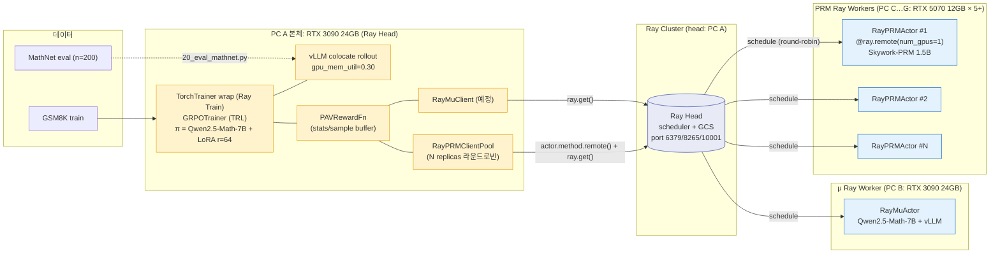
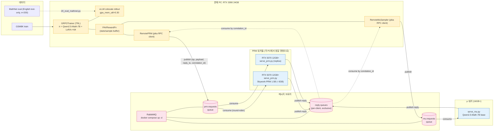
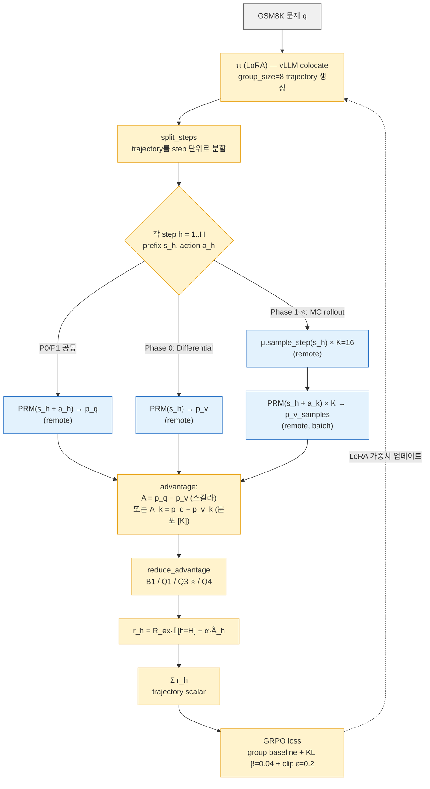
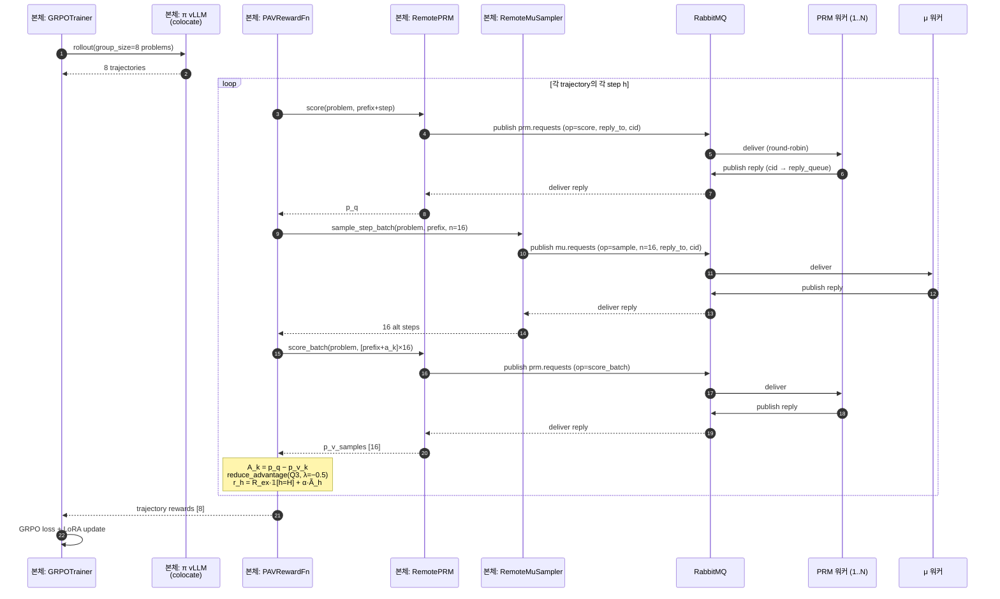
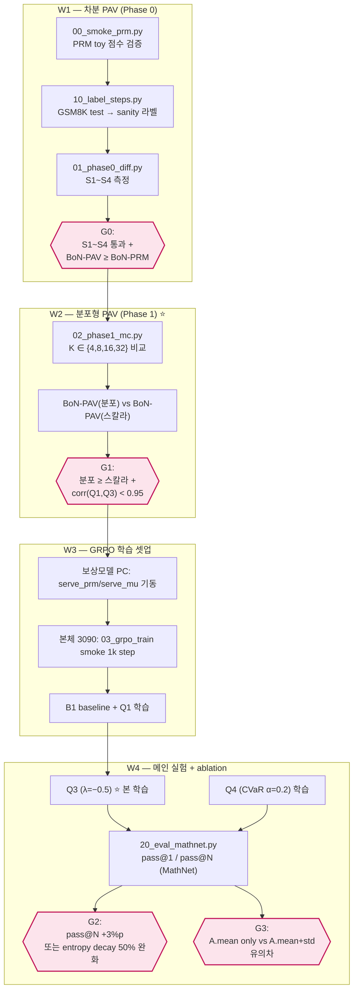
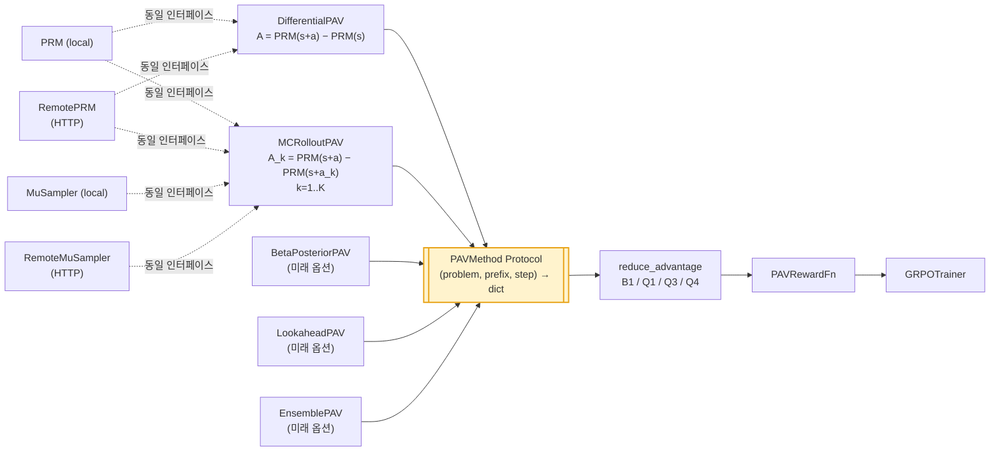

# 학습 흐름 다이어그램

PAV-RL 파이프라인의 **시스템 구조 → 한 step 데이터 흐름 → 한 step RPC 시퀀스 → 4주 실행 단계**.
모든 다이어그램은 mermaid (GitHub / VSCode 미리보기에서 자동 렌더).

---

## 1. 시스템 구조 (Ray cluster, 마이그레이션 중)

> 이전 RabbitMQ 구조는 [STAGE_TEST_REPORT.md](STAGE_TEST_REPORT.md)에서 Stage 0~8 검증 끝남(history). Ray 전환 진행 상황 — [RAY_MIGRATION.md](RAY_MIGRATION.md).



**핵심**:
- 본체는 `actor.method.remote()` + `ray.get()`로 동기 결과 (기존 PRM 인터페이스 보존).
- Ray scheduler가 N replicas에 자동 라운드로빈. `RayPRMClientPool.score_batch`는 N-way 자동 분산.
- 5070 ×5이면 PRM RPC throughput 5배 → 본체 step latency의 PRM 부분 ~1/5로.
- 본체 VRAM 약 22GB로 3090 한 장 (PRM/μ는 0).
- μ는 7B라 별도 3090(24GB) 단일 인스턴스 (PC B).

---

## 1-legacy. 시스템 구조 (RabbitMQ 분산 큐, history)

<details>
<summary>이전 RabbitMQ 다이어그램 (참고용 — 클릭해서 펼치기)</summary>



- 본체는 publish만, 워커들이 consume — 워커 추가/제거 시 본체 코드 무수정.
- RabbitMQ가 `prm.requests`/`mu.requests` 큐를 워커들에게 라운드로빈 분산.
- 표준 AMQP RPC 패턴 (`reply_to` + `correlation_id`)으로 응답 매칭.

</details>

---

## 2. 한 GRPO step 안의 데이터 흐름



`pav.method`(`differential` ↔ `mc_rollout`) 한 줄만 바꾸면 위 두 분기 사이를 swap.

---

## 3. 한 step의 RPC 시퀀스 (Phase 1, K=16) — RabbitMQ AMQP



**핵심 최적화**:
- **vLLM prefix caching** — 같은 prefix에서 K=16 sampling이 single forward에 가깝게 빠름.
- **score_batch endpoint** — 16개 prefix를 한 AMQP 요청에 묶어 워커가 한 번의 PRM batch forward.
- **워커 풀 라운드로빈** — RabbitMQ가 자동으로 idle 워커에 분산. PRM 워커 N개 띄우면 throughput N배.

---

## 4. 4주 실행 단계와 게이트



---

## 5. PAVMethod Protocol 단일화 — 왜 swap이 자유로운가



- **추출 방식 추가** (BetaPosterior, Lookahead, Ensemble …): `PAVMethod` 만족 → RL 코드 0줄 수정
- **로컬 ↔ 원격(RabbitMQ) 분산 swap**: `mode: local|remote` yaml 키 한 줄 → `PAVRewardFn` 0줄 수정
- **transport 변경** (HTTP → AMQP → gRPC …): handlers.py만 그대로 두고 client/worker 교체 → handlers 0줄 수정

---

## 6. 각 워커 / 본체 최소·권장 사양

### 6.1 한눈에 비교

| 컴포넌트 | GPU 최소 | GPU 권장 | CPU | RAM | 디스크 | 비고 |
|---|---|---|---|---|---|---|
| **RabbitMQ broker** | — (CPU만) | — | 2 core | 2GB | 5GB | 분산 시 LAN 1Gbps 권장 |
| **PRM 워커** | 6GB VRAM (RTX 3060 12G / RTX 4060 8G) | 12~16GB (RTX 4060 Ti 16G / **RTX 5070 12G**) | 4 core | 8GB | 10GB | PRM 1.5B fp16 ~3GB. 여러 PC 분산 가능 |
| **μ 워커** | 16GB VRAM (RTX 4060 Ti 16G) | **24GB** (RTX 3090/4090) | 4~8 core | 16GB | 30GB | Qwen2.5-Math-7B bf16 ~14GB + KV cache |
| **본체 (trainer)** | **24GB** (RTX 3090/4090) | 48GB (A6000) ~ 80GB (H100) | 8~16 core | 32GB+ | 100GB+ | π 7B + LoRA + vLLM colocate ≈ 22GB |

> 기준: PRM=1.5B, π/μ=Qwen2.5-Math-7B-Instruct, LoRA r=64, Phase 1 K=16.
> "GPU 최소" = 띄우는 데 OOM 안 나는 한계, "GPU 권장" = batch/throughput 안정.

---

### 6.2 RabbitMQ broker (GPU 불필요)

| 항목 | 최소 | 권장 |
|---|---|---|
| CPU | 2 core | 4 core |
| RAM | 2GB | 4GB |
| 디스크 | 5GB | 10GB (메시지 영속화 시 ↑) |
| 네트워크 | 100Mbps | **1Gbps LAN** |
| OS | Docker 호스트면 무관 (Linux/Windows/Mac) | Linux 권장 |

- 메시지 자체는 작음 (~수 KB) — broker가 throughput 병목이 되는 일은 거의 없음.
- 본체와 같은 PC에 띄워도 무방. 별도 PC면 LAN 라운드트립 ≤2ms 권장.

---

### 6.3 PRM 워커 (Skywork-PRM 1.5B)

| 항목 | 최소 | 권장 |
|---|---|---|
| **GPU** | RTX 3060 12GB / RTX 4060 8GB | **RTX 4060 Ti 16GB / RTX 5070 12GB** |
| VRAM | 6GB (모델 ~3GB + activation + KV) | 12~16GB |
| CPU | 4 core | 8 core |
| RAM | 8GB | 16GB |
| 디스크 | 10GB (모델 + HF 캐시) | 30GB (학습 데이터 캐시 공유 시) |
| 네트워크 | 100Mbps | 1Gbps |

- **여러 PC에 동시 분산 가능** — RabbitMQ가 라운드로빈. N대면 throughput N배.
- prefetch=1 (compose 기본) → 워커 1대당 in-flight 1개. GPU OOM 절대 안 남.
- 모델 가중치 ~2.9GB는 첫 호출 시 lazy 다운 → HF 캐시 영속화로 재기동 비용 0.

---

### 6.4 μ 워커 (Qwen2.5-Math-7B base, vLLM)

| 항목 | 최소 | 권장 |
|---|---|---|
| **GPU** | RTX 4060 Ti 16GB / RTX 4070 12GB(빡빡) | **RTX 3090 24GB / RTX 4090 24GB** |
| VRAM | 16GB (모델 14GB + KV cache 좁게) | 24GB (K=16 batch 안정 + prefix caching 여유) |
| CPU | 4 core | 8 core |
| RAM | 16GB | 32GB |
| 디스크 | 30GB | 50GB |
| 네트워크 | 100Mbps | 1Gbps (응답 길이 ~K개×수십토큰) |

- 7B 모델이라 12GB GPU(RTX 4070)에서는 KV cache 압박 → max_model_len 줄여야 함.
- prefix caching 효과로 K=16 sampling이 K=1과 비슷한 비용.
- μ가 학습 중 변하지 않으므로 weight load는 1회.

---

### 6.5 본체 trainer (3090 24GB 기준)

| 항목 | 최소 | 권장 | 충분 |
|---|---|---|---|
| **GPU** | **RTX 3090 / 4090 24GB** | A6000 Ada 48GB | H100 80GB ×2 |
| VRAM | 22GB (가용 한계) | 40GB+ | 80GB+ (멀티 정책 동시 실험) |
| CPU | 8 core | 16 core | 32 core |
| RAM | 32GB | 64GB | 128GB |
| 디스크 | 100GB (체크포인트 + W&B logs) | 500GB SSD | 1TB NVMe |
| 네트워크 | 1Gbps (broker LAN + W&B push) | 1Gbps | 1Gbps |
| Shared mem | 8GB (`shm_size: 8g` compose 설정) | — | — |

본체 VRAM 분해 (3090 24GB / PRM·μ remote 가정):

| 항목 | 메모리 |
|---|---|
| π base 7B (bf16, frozen) | ~14GB |
| LoRA r=64 + Adam optimizer states | ~1.2GB |
| vLLM colocate rollout (`gpu_mem_util=0.30`) | ~7~9GB |
| **합계** | **~22GB** ✅ |

> 24GB GPU에서 안전 마진은 ~2GB. group_size를 8 → 16으로 늘리거나 `max_completion_length`를 1024로 키우면 OOM 위험.
> RTX 4090 / 3090 모두 ECC 없는 일반 GPU라 장시간 학습 시 ECC 메모리 GPU 권장.

---

### 6.6 분산 토폴로지 예시 3가지

#### A. 미니멈 (1 PC, 단일 GPU 24GB)
```
[3090 24GB] — broker(docker) + PRM worker + μ worker + trainer
```
모든 service `--profile all up`. 단 vLLM colocate가 8~9GB만 가져감 + μ 7B(14GB) + PRM 1.5B(3GB) 동시는 빡빡 → **사실상 Phase 0만 가능**, Phase 1은 K=4 정도.

#### B. 작은 분산 (2 PC) ⭐ 가장 균형
```
[PC 1: 3090 24GB] — broker + trainer
[PC 2: 4060 Ti 16GB] — PRM 워커 + μ 워커  (또는 PRM만)
```
Phase 1 K=16 가능. 본체에 broker 같이 띄움 → LAN 의존성 ↓.

#### C. 풀 분산 (3+ PC, 권장)
```
[PC 1: 미니PC]    — broker
[PC 2: 5070 12GB] — PRM 워커 (replica 가능)
[PC 3: 4090 24GB] — μ 워커
[PC 4: 3090 24GB] — trainer
```
PRM 워커 PC를 늘리면 throughput 선형 증가. broker는 idle 시 자원 거의 0.

---

## 참고
- 시스템 결정 사항: [IMPLEMENTATION_REPORT.md §3](IMPLEMENTATION_REPORT.md)
- 가중치 다운로드: `scripts/download_models.py`
- 분산 모드 사용법: [README.md](../README.md) § "분산 구조"
