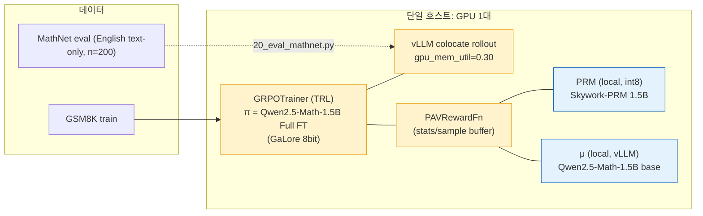
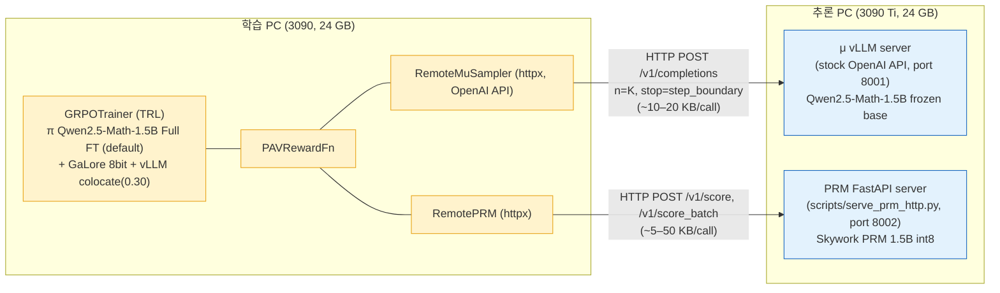
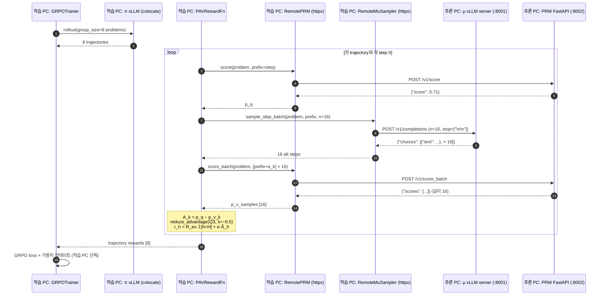
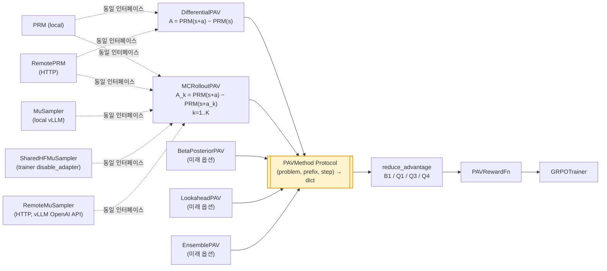

# 학습 흐름 다이어그램

PAV-RL 파이프라인의 **시스템 구조 (단일/분산) → 한 step 데이터 흐름 → RPC 시퀀스 → 4주 실행 단계**.
모든 다이어그램은 mermaid (GitHub / VSCode 미리보기에서 자동 렌더).

> **현재 default 모델 — π / μ = Qwen2.5-Math-1.5B-Instruct, π는 Full FT** (`full_ft: true`).
> Skywork PRM 1.5B int8. 7B QLoRA로 확장은 yaml 키 변경만으로 가능.
>
> **두 가지 배포 모드 지원** — (A) **단일 PC** (모두 같은 GPU) 또는 (B) **2 PC 분산**
> (μ + PRM을 추론 PC로 분리, HTTP transport). yaml의 `mode` 키 한 줄로 swap.

---

## 1A. 시스템 구조 — 단일 PC



**핵심**:
- PRM·μ 모두 단일 GPU에 함께 적재 — RPC 없음, 함수 호출.
- 1.5B Full FT + μ 1.5B + PRM 1.5B = 24 GB GPU 1장에 충분히 들어옴 (~12 GB).
- 7B 정책/μ로 확장 시 24 GB로는 빡빡 → 분산 권장.

## 1B. 시스템 구조 — 2 PC 분산 ⭐



**핵심**:
- **weight broadcast 0** — π는 학습 PC 안에서 trainer + (선택적) vLLM colocate가 공유.
  μ/PRM은 frozen이라 1회 로드.
- **모든 통신 HTTP/JSON** — broker(RabbitMQ 등) 없음.
- **μ 서버는 vLLM 기본 OpenAI 호환 API 그대로** — 별도 서버 코드 0줄.
- **환경변수 override** — `PRM_ENDPOINT` / `MU_ENDPOINT`로 yaml 수정 없이 IP 교체.

---

## 2. 한 GRPO step 안의 데이터 흐름

```mermaid
flowchart TB
    Q["GSM8K 문제 q"]:::data
    Q --> PI["π (LoRA/QLoRA) — vLLM colocate<br>group_size=8 trajectory 생성"]:::main

    PI --> SPLIT["split_steps<br>trajectory를 step 단위로 분할"]:::main
    SPLIT --> LOOP{"각 step h = 1..H<br>prefix s_h, action a_h"}:::main

    LOOP -->|"P0/P1 공통"| PRM_PQ["PRM(s_h + a_h) → p_q<br>(local OR HTTP)"]:::call

    LOOP -->|"Phase 0: Differential"| PRM_PV["PRM(s_h) → p_v<br>(local OR HTTP)"]:::call
    LOOP -->|"Phase 1 ⭐: MC rollout"| MU_K["μ.sample_step(s_h) × K=16<br>(local OR HTTP /v1/completions, n=K)"]:::call
    MU_K --> PRM_K["PRM(s_h + a_k) × K → p_v_samples<br>(local OR HTTP /v1/score_batch)"]:::call

    PRM_PQ --> ADV["advantage:<br>A = p_q − p_v (스칼라)<br>또는 A_k = p_q − p_v_k (분포 [K])"]:::main
    PRM_PV --> ADV
    PRM_K --> ADV

    ADV --> RED["reduce_advantage<br>B1 / Q1 / Q3 ⭐ / Q4"]:::main
    RED --> R["r_h = R_ex·𝟙[h=H] + α·Ã_h"]:::main
    R --> SUM["Σ r_h<br>trajectory scalar"]:::main
    SUM --> GRPO["GRPO loss<br>group baseline + KL β=0.04 + clip ε=0.2"]:::main
    GRPO -.->|"LoRA / QLoRA / FullFT 가중치 업데이트"| PI

    classDef data fill:#f0f0f0,stroke:#666
    classDef main fill:#fff3cd,stroke:#e8a317
    classDef call fill:#e3f2fd,stroke:#1565c0
```

`pav.method`(`differential` ↔ `mc_rollout`) 한 줄만 바꾸면 위 두 분기 사이를 swap.
`prm.mode` / `mu.mode` 한 줄만 바꾸면 local ↔ remote swap.

---

## 3. 학습 타임라인 (1 Optimizer Step)

`gradient_accumulation_steps=8` 설정 시, 1개의 optimizer step은 아래와 같이 8개 micro-batch를 순차 처리합니다.

```mermaid
gantt
    title 1 Optimizer Step = 8 Micro-batches (Effective Batch = 64)
    dateFormat HH:mm:ss
    axisFormat %M:%S

    section Micro-batch 1 (8 samples)
    vLLM generate (π rollout)       :done, 00:00:00, 00:00:15
    split_steps + verifier (CPU)    : 00:00:15, 00:00:16
    Step-wise μ+PRM (×H steps)      :crit, 00:00:16, 00:00:23
    Reward sum + advantage (GPU)    : 00:00:23, 00:00:26
    Backward + grad accum           :done, 00:00:26, 00:00:38

    section Micro-batch 2 (8 samples)
    vLLM generate (π rollout)       :done, 00:00:38, 00:00:53
    split_steps + verifier (CPU)    : 00:00:53, 00:00:54
    Step-wise μ+PRM (×H steps)      :crit, 00:00:54, 00:01:01
    Reward sum + advantage (GPU)    : 00:01:01, 00:01:04
    Backward + grad accum           :done, 00:01:04, 00:01:16

    section Micro-batch 3 (8 samples)
    vLLM generate (π rollout)       :done, 00:01:16, 00:01:31
    split_steps + verifier (CPU)    : 00:01:31, 00:01:32
    Step-wise μ+PRM (×H steps)      :crit, 00:01:32, 00:01:39
    Reward sum + advantage (GPU)    : 00:01:39, 00:01:42
    Backward + grad accum           :done, 00:01:42, 00:01:54

    section Micro-batch 4 (8 samples)
    vLLM generate (π rollout)       :done, 00:01:54, 00:02:09
    split_steps + verifier (CPU)    : 00:02:09, 00:02:10
    Step-wise μ+PRM (×H steps)      :crit, 00:02:10, 00:02:17
    Reward sum + advantage (GPU)    : 00:02:17, 00:02:20
    Backward + grad accum           :done, 00:02:20, 00:02:32

    section Micro-batch 5-7
    ... (3 more)                    : 00:02:32, 00:04:56

    section Micro-batch 8 (8 samples)
    vLLM generate (π rollout)       :done, 00:04:56, 00:05:11
    split_steps + verifier (CPU)    : 00:05:11, 00:05:12
    Step-wise μ+PRM (×H steps)      :crit, 00:05:12, 00:05:19
    Reward sum + advantage (GPU)    : 00:05:19, 00:05:22
    Backward + grad accum           :done, 00:05:22, 00:05:34

    section Optimizer
    optimizer.step()                :milestone, 00:05:34, 00:05:35
```



- **Micro-batch** = 8개 샘플 (`per_device_train_batch_size=8`)
- **Gradient Accumulation** = 8회 반복
- **Effective Batch** = 8 × 8 = 64개 샘플
- **Optimizer.step()** = 8개 micro-batch 끝난 후 **1번만** 실행

**GPU 사용 패턴:**
- **큰 피크** (CUDA 100%): vLLM rollout 생성 + Policy backward
- **작은 피크** (CUDA 30%): Reward/Advantage/KL 계산
- **사이 텀** (CUDA 0%): PRM HTTP 요청/응답 대기 (네트워크 I/O)

---

## 4. 분산 모드 — 한 step의 HTTP 시퀀스 (Phase 1, K=16)



**핵심 최적화**:
- **vLLM `n=K` parameter** — 같은 prefix에서 K alternative를 단일 batch로 생성 (prefix caching 활용)
- **`/v1/score_batch` 엔드포인트** — 16 prefix를 한 HTTP 호출에 묶어 PRM 서버에서 batch forward
- **HTTP keep-alive** — httpx Client가 connection pool 유지 → connection setup 비용 0

---

## 5. 4주 실행 단계와 게이트


---

## 6. PAVMethod Protocol + transport 추상화



- **추출 방식 추가** (BetaPosterior, Lookahead, Ensemble …): `PAVMethod` 만족 → RL 코드 0줄 수정
- **로컬 ↔ 원격 swap**: `mode: local|remote` yaml 키 한 줄 → `PAVRewardFn` 0줄 수정
- **μ backend swap**: `vllm`/`shared`/`remote` 3가지 → MCRolloutPAV 0줄 수정

---

## 7. 권장 사양

### 6.1 단일 PC

| 항목 | 최소 | 권장 | 충분 |
|---|---|---|---|
| **GPU** | RTX 3090 / 4090 24GB | A6000 Ada 48GB | A100 / H100 80GB |
| VRAM | 22GB (Phase 0, 정책 1.5B) | 40GB+ (Phase 1 K=16, 모두 적재) | 80GB+ |
| CPU | 8 core | 16 core | 32 core |
| RAM | 32GB | 64GB | 128GB |
| 디스크 | 100GB | 500GB SSD | 1TB NVMe |
| Shared mem | 8GB (`shm_size: 8g`) | — | — |

### 6.2 2 PC 분산 (3090 + 3090 Ti) ⭐ 권장 — 현재 default

**학습 PC (3090 24GB)**

| 시나리오 | VRAM | 마진 |
|---|---:|---:|
| **π 1.5B Full FT + GaLore 8bit + vLLM colocate(0.30)** ⭐ default | **~17 GB** | **7 GB ✅** |
| π 7B + 4bit QLoRA + LoRA + vLLM colocate(0.30) | ~13 GB | 11 GB ✅ |
| π 7B + LoRA (bf16) + vLLM colocate(0.30) | ~22 GB | 2 GB ⚠ |

**추론 PC (3090 Ti 24GB)**

| 항목 (default — 1.5B μ) | VRAM |
|---|---:|
| **μ 1.5B vLLM (bf16, `gpu_mem`=0.25)** ⭐ | **~6 GB** |
| **PRM Skywork 1.5B (int8 via bnb)** | **~1.7 GB** |
| **합계** | **~8 GB** ✅ 마진 16 GB (매우 안전) |

| 항목 (7B μ 옵션) | VRAM |
|---|---:|
| μ 7B vLLM (bf16, `gpu_mem`=0.65) | ~15.6 GB |
| PRM Skywork 1.5B (int8) | ~1.7 GB |
| 합계 | ~17 GB ✅ 마진 7 GB |

### 6.3 네트워크 부하 (분산 모드)

| 트래픽 | 1 step당 호출 | 1 호출 크기 | 합 |
|---|---:|---:|---:|
| PRM `score` / `score_batch` (Phase 1, K=16) | ~160 | ~5–50 KB | ~4 MB |
| μ `sample_step_batch` (n=16) | ~80 | ~10–20 KB | ~1.5 MB |
| **합계 / step** | | | **~6 MB** |

| 네트워크 | step당 오버헤드 | 학습 영향 |
|---|---:|---|
| **100 Mbps** (gigabit 미만) | ~0.5 s | 1–2% (step 자체 30–60 s) ✅ |
| 1 Gbps | ~50 ms | <0.5% ✅ |
| 10 Gbps | ~5 ms | 무시 가능 ✅ |

**weight broadcast 0** — 학습 PC 안에서 trainer + vLLM colocate가 π weight 공유. μ/PRM은 frozen.

### 6.4 24GB 단일 호스트 VRAM 분해 — 옵션별

**옵션 A ⭐ (현재 default). Phase 1 (μ 포함, 1.5B Full FT, 모두 local)**
| 항목 | 메모리 |
|---|---|
| π 1.5B base (bf16) | ~3.1 GB |
| gradients (bf16) | ~3.1 GB |
| GaLore 8bit states | ~3.1 GB |
| activations (grad-ckpt, group=8) | ~2–3 GB |
| vLLM colocate (`gpu_mem_util=0.30`) | ~4.8 GB |
| PRM 1.5B (int8) | ~1.7 GB |
| μ 1.5B (bf16) | ~3 GB |
| **합계** | **~21 GB** ✅ 마진 3 GB |

→ 단일 24 GB에서도 1.5B Full FT + Phase 1 (μ 1.5B) 모두 들어옴. 안전 마진 작아 group_size 키울 때 주의.

**옵션 B. Phase 0 (μ 불필요, 1.5B Full FT)**
| 항목 | 메모리 |
|---|---|
| π 1.5B + GaLore 8bit + grads | ~9.3 GB |
| activations | ~2–3 GB |
| vLLM colocate (0.20) | ~4.8 GB |
| PRM 1.5B (int8) | ~1.7 GB |
| **합계** | **~18 GB** ✅ 마진 6 GB |

**옵션 C. Phase 1 (μ 7B, LoRA 정책) — 40GB+ 권장**
| 항목 | 메모리 |
|---|---|
| π 7B base (bf16) | ~14 GB |
| LoRA r=64 + Adam | ~1.2 GB |
| vLLM colocate (`gpu_mem_util=0.30`) | ~4.8 GB |
| PRM 1.5B (int8) | ~1.7 GB |
| μ 7B (bf16) | ~15 GB |
| **합계** | **~37 GB** — A100/A6000+ |

**옵션 D ⭐ (분산 default). 1.5B Full FT — 24GB 카드 2장**
| 학습 PC (3090) | 추론 PC (3090 Ti) |
|---|---|
| π 1.5B Full FT + GaLore 8bit + vLLM(0.20) ~17 GB | μ 1.5B vLLM(0.25) ~6 GB |
| | PRM 1.5B int8 ~1.7 GB |
| **마진 7 GB ✅** | **마진 16 GB ✅ (매우 안전)** |

**옵션 E. 7B로 확장 — 분산 카드 2장**
| 학습 PC (3090) | 추론 PC (3090 Ti) |
|---|---|
| π 7B QLoRA + LoRA + vLLM(0.20) ~13 GB | μ 7B vLLM(0.65) ~15.6 GB |
| | PRM 1.5B int8 ~1.7 GB |
| **마진 11 GB ✅** | **마진 7 GB ✅** |

> 24GB GPU에서 안전 마진은 ~2GB. group_size를 8 → 16으로 늘리거나 `max_completion_length`를 1024로 키우면 OOM 위험.

---

## 참고
- **빠른 실행 (2 PC 분산)**: [QUICKSTART.md](QUICKSTART.md)
- 시스템 결정 사항: [IMPLEMENTATION_REPORT.md §3](IMPLEMENTATION_REPORT.md)
- 가중치 다운로드: [scripts/download_models.py](../scripts/download_models.py)
- 단일 PC 실행: `bash run_train.sh --mode {smoke|phase0|phase1}`
- 분산 실행 (직접 LAN): `PRM_ENDPOINT=... MU_ENDPOINT=... bash run_train.sh --mode phase1`
- Docker (단일 PC swap pipeline): `docker compose -f docker-compose.single.yml up -d`
- Docker (분산 — 학습 PC + frps): `FRPS_TOKEN=<random> docker compose up -d`
- Docker (분산 — 추론 PC, frpc): `FRPS_ADDR=<공인IP/DDNS> FRPS_TOKEN=<같은토큰> NODE_NAME=<라벨> docker compose -f docker-compose.inference.yml up -d`
- FRP dashboard: `http://<학습PC>:7500` (admin / FRPS_DASHBOARD_PW)

---

## 7. 분산 인프라 (3가지 모드)

| 모드 | hw | network | 특징 |
|---|---|---|---|
| **단일 PC swap** | 1 GPU | 없음 (모두 local) | π/PRM/μ를 GPU↔CPU dynamic swap. Phase 1 K=16까지 가능, 매우 안정. step time ~60-90초 |
| **분산 LAN 직접** | 2+ GPU (같은 LAN) | LAN 사설 IP | 학습 PC trainer ↔ 추론 PC (mu-server, prm-server). 사설 IP로 직접 HTTP. step ~50초 |
| **FRP TCP tunnel** ⭐ | N GPU (어디든, 학습 PC 공인 IP 보유) | 학습 PC = frps, 추론 PC = frpc outbound | 추론 PC NAT/CGNAT 무관. frpc → frps single persistent TCP 1개. frps native load balancing + health check. cluster discovery 자동. 무중단 학습 + fail-over |

> **이전 시도 (폐기): ZeroTier mesh + nginx-lb + MOON** — 두 PC 모두 NAT 뒤일 때 PLANET RELAY 의 packet loss 로 K=16 long-lived TCP 자주 끊김. MOON root 자체 호스팅도 NAT punching 협상 실패. 학습 PC 공인 IP 있으면 FRP 가 단순/안정.

### 7.1 FRP 모드 컴포넌트

```
[학습 PC, 공인 IP]                                          [추론 PC들 (NAT/CGNAT 뒤)]
 ┌────────────────────────────────────────────────┐         ┌──────────────────────┐
 │ trainer ──http://frps:18001/18002──► frps      │         │ frpc                 │
 │                                       │        │         │  └─ outbound TCP 1개 │
 │                                       │        │         │     persistent       │
 │                              load balancer group         │     multiplexed      │
 │                              ─ round-robin    ◄┼─────────┤                      │
 │                              ─ HTTP health     │  공인   │ mu-server (8001)     │
 │                                 check (10s)    │   IP    │ prm-server (8002)    │
 │                                       │        │  :7000  │                      │
 │ FRP dashboard (port 7500)             │        │         └──────────────────────┘
 │  └─ 모든 frpc 상태/트래픽/health 실시간│                            ▲
 │                                                │                            │
 │                                                │  [추론 PC #2, #3, ...]     │
 │                                                │   frpc ─────────────────────┘
 └────────────────────────────────────────────────┘

핵심:
- 추론 PC 는 outbound TCP 만 — NAT/CGNAT/symmetric NAT 모두 무관
- 학습 PC frps 가 받은 요청을 살아있는 추론 PC frpc 1개로 라우팅 (round-robin)
- 한 추론 PC 의 frpc 가 30초 health check 실패 → 자동 LB pool 제거
- 노드 추가/제거 = 추론 PC 에서 docker compose up/down — 학습 PC 무수정
```

핵심 파일:
- [docker-compose.yml](../docker-compose.yml) — 학습 PC `frps` + `trainer` + `dashboard`
- [docker-compose.inference.yml](../docker-compose.inference.yml) — 추론 PC `frpc` + `mu-server` + `prm-server`
- [frp/frps.toml](../frp/frps.toml) — frps 설정 (token via env)
- [frp/frpc.toml](../frp/frpc.toml) — frpc 설정 (token/주소/노드명 via env, load balancer group + health check)
