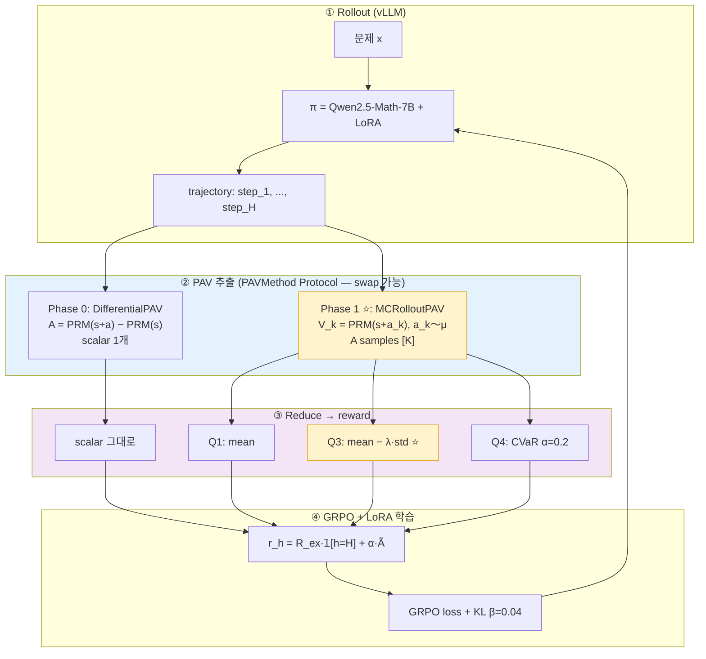

# 구현 계획 — 차분 PAV + 분포형 보상 (Phase 0)

<aside>
🎯

**목표** — 공개 PRM(Skywork-o1-Open-PRM-Qwen-2.5-7B, 이하 "천공 PRM")을 그대로 두고 **Phase 0**: 두 번 forward 차분으로 scalar advantage smoke → **Phase 1 ⭐**: μ로부터 K개 rollout으로 V 분포 추정 (D-PAV). 두 방식은 단일 **`PAVMethod` Protocol**을 공유 — RL 코드 수정 없이 swap. 추가 PRM 학습 없이 4주 안에 GRPO+LoRA 학습까지 도달.

</aside>

## 1. 결정 사항 (Lock-in)

| **항목** | **선택** | **근거** |
| --- | --- | --- |
| PAV 추출 방식 | **Two-forward 차분** `A = PRM(s+a) − PRM(s)` (Phase 0) | 추가 학습 0, 즉시 적용 |
| 분포화 방식 | **MC rollout** (K=16, μ로부터 sampling, Phase 1) | 실제 V 분포 추정. `PAVMethod` Protocol로 추후 교체 용이 |
| PRM 모델 | **Skywork-o1-Open-PRM-Qwen-2.5-7B** (천공, 4-bit AWQ) | step-level PRM 공개 SOTA, Qwen2.5 family 호환 (정책과 토크나이저 정렬), RTX 4090 24GB 적합 |
| 정책 π | Qwen2.5-Math-7B-Instruct + LoRA r=64 | 동일 family, μ≠π 자연스러움 |
| Prover μ | Qwen2.5-Math-7B-Instruct (frozen base) | μ ≠ π 보장 |
| RL 알고리즘 | GRPO (TRL ≥0.11, vLLM colocate) | PPO보다 메모리 절약, group baseline |
| 주력 RL 조건 | **Q3 (risk-seeking, mean − λ·std, λ=−0.5)** ⭐ | exploration 촉진 |

## 2. 시스템 구조



## 3. Phase 0 — 차분 PAV (scalar baseline)

### 3-1. 디렉토리 구조

```jsx
pav-rl/
├── configs/
│   ├── prm.yaml          # Skywork-o1-Open-PRM-Qwen-2.5-7B (천공) AWQ
│   ├── policy.yaml       # Qwen2.5-Math-7B + LoRA r=64
│   └── rl_q3.yaml        # GRPO + Q3 reward, K=16
├── src/
│   ├── prm/
│   │   ├── loader.py          # AWQ 4-bit 로딩, vLLM 호환
│   │   └── score.py           # PRM.score() + score_batch()
│   ├── pav/
│   │   ├── base.py            # ★ PAVMethod Protocol (swap 인터페이스)
│   │   ├── differential.py    # ★ Phase 0: DifferentialPAV
│   │   ├── mc_rollout.py      # ★ Phase 1: MCRolloutPAV (메인)
│   │   └── reduce.py          # B1/Q1/Q3/Q4 — 분포/스칼라 둘 다 처리
│   ├── rollout/
│   │   ├── parser.py          # step 경계 (\n\n, Step k:)
│   │   ├── mu_sampler.py      # ★ μ.sample_step(problem, prefix) → step_str
│   │   └── vllm_rollout.py
│   ├── train/
│   │   ├── grpo_trainer.py    # TRL + LoRA
│   │   └── reward_fn.py       # PAVRewardFn (PAVMethod 하나만 받음)
│   └── eval/
│       ├── bon_pav.py
│       └── sanity.py
├── scripts/
│   ├── 00_smoke_prm.py
│   ├── 01_phase0_diff.py      # DifferentialPAV smoke + sanity S1~S4
│   ├── 02_phase1_mc.py        # MCRolloutPAV smoke + K 비교
│   └── 03_grpo_train.py
└── tests/
    └── test_pav_swap.py       # Phase 0 ↔ Phase 1 동일 RL 코드 동작 검증
```

### 3-2. 공통 인터페이스 — `src/pav/base.py`

추후 다른 추출 방식으로 갈아끼워 쓰도록 **단일 Protocol**로 통일. RL 조립 코드는 이 인터페이스만 의존.

```python
from typing import Protocol, runtime_checkable
import torch

@runtime_checkable
class PAVMethod(Protocol):
    """advantage 추출 방식의 통일 인터페이스.
    
    구현체는 (problem, prefix, step) → dict 반환.
      필수: advantage_scalar     (단일 값, scalar fallback용)
      선택: advantage_samples    [K] 분포일 때만 — 없으면 reducer가 scalar로 fallback
      디버깅: p_q, p_v, p_v_samples 등
    
    새 방식 추가 시 이 Protocol만 만족하면 RL 코드 수정 불필요.
    """
    name: str
    def __call__(
        self, problem: str, prefix: str, step: str
    ) -> dict[str, torch.Tensor]: ...
```

### 3-3. `src/pav/differential.py` — Phase 0 구현

```python
import torch

class DifferentialPAV:
    """A = PRM(s+a) − PRM(s) — scalar 1개. 추가 학습 0, smoke test용."""
    name = "differential"
    
    def __init__(self, prm):
        self.prm = prm
    
    @torch.no_grad()
    def __call__(self, problem, prefix, step):
        p_q = self.prm.score(problem, prefix + step)
        p_v = self.prm.score(problem, prefix)
        return {
            "advantage_scalar":  p_q - p_v,
            "advantage_samples": None,    # 분포 없음 → reducer가 scalar fallback
            "p_q": p_q, "p_v": p_v,
        }
```

### 3-4. Sanity check 4종 (Phase 0 통과 기준)

<aside>
✅

**S1**. 정답 step에서 `A > 0` 비율 ≥ **70%**

**S2**. 무의미한 filler step ("Let me think...")에서 `|A| < 0.05` 비율 ≥ 60%

**S3**. 오답 step에서 `A < 0` 비율 ≥ 60%

**S4**. `p_v` (prefix-only) 점수 분포가 단봉이 아닐 것 — PRM이 prefix를 제대로 평가하는지 확인

</aside>

S4 실패 시 → PRM이 *완성된 step* 단위로만 학습됐다는 뜻 → Phase 1 MC rollout으로 자연 전환 (V를 prefix-only PRM 대신 μ-rollout으로 추정).

## 4. Phase 1 — Rollout 분포화 (메인 ⭐)

### 4-1. 아이디어

V를 K개 μ-rollout으로 추정 → 각 rollout이 advantage의 한 sample이 됨:

```
A_k = PRM(s + a) − PRM(s + a_k),   a_k ～ μ(·|s),   k = 1..K
A^μ ～ {A_1, A_2, ..., A_K}          ← K개 sample 분포
```

장점:

- **진짜 V 분포** (Phase 0의 prefix-only PRM 근사 없음)
- **μ ≠ π 명시적** — μ는 frozen base, π는 학습 중 → Theorem 3.1 자연 만족
- **vLLM prefix caching**으로 K rollout 비용 ≪ K× 단일 forward

### 4-2. `src/pav/mc_rollout.py`

```python
import torch

class MCRolloutPAV:
    """V를 K개 μ-rollout으로 추정해 advantage 분포 생성. PAVMethod 만족."""
    name = "mc_rollout"
    
    def __init__(self, prm, mu, K: int = 16):
        self.prm = prm
        self.mu = mu       # mu.sample_step(problem, prefix) → step_str
        self.K = K
    
    @torch.no_grad()
    def __call__(self, problem, prefix, step):
        # Q deterministic — π가 실제로 둔 step
        p_q = self.prm.score(problem, prefix + step)
        
        # K개 alternative step from μ (vLLM prefix cache 활용)
        alt_steps = [self.mu.sample_step(problem, prefix) for _ in range(self.K)]
        p_v_samples = self.prm.score_batch(
            problem, [prefix + a for a in alt_steps]
        )   # [K]
        
        A_samples = p_q - p_v_samples   # [K] advantage 분포
        return {
            "advantage_scalar":  A_samples.mean(),
            "advantage_samples": A_samples,
            "p_q": p_q,
            "p_v_samples": p_v_samples,
        }
```

### 4-3. `src/pav/reduce.py` — 분포 ↔ 스칼라 통합 reducer

```python
import torch

def reduce_advantage(
    out: dict,
    mode: str = "Q3",
    lam: float = -0.5,
    cvar_alpha: float = 0.2,
) -> float:
    A = out.get("advantage_samples")
    
    # 분포 없으면 (Phase 0 DifferentialPAV) → scalar fallback
    if A is None:
        if mode == "B1":
            return float((out["advantage_scalar"] > 0).item())
        return out["advantage_scalar"].item()
    
    # 분포 있으면 (Phase 1 MCRolloutPAV) → 분포 통계
    if mode == "B1":  return float((A.mean() > 0).item())
    if mode == "Q1":  return A.mean().item()
    if mode == "Q3":  return (A.mean() - lam * A.std()).item()    # ⭐ 메인
    if mode == "Q4":
        k = max(1, int(A.numel() * cvar_alpha))
        return A.sort()[0][:k].mean().item()
    raise ValueError(f"Unknown mode: {mode}")
```

같은 reducer로 Phase 0 (스칼라) ↔ Phase 1 (분포) **switch 비용 0**.

### 4-4. K 선택 가이드

| **K** | **PRM forward / step** | **분포 정확도** | **권장** |
| --- | --- | --- | --- |
| 4 | 5 (= 1 + K) | 거침, std/CVaR unstable | 디버깅, 빠른 smoke |
| 8 | 9 | 보통 | dev 단계 |
| **16** ⭐ | 17 | 안정적 std/CVaR | **메인** |
| 32 | 33 | 매우 안정 | 정밀 비교 |

K=16 + vLLM prefix caching 가정 시 RTX 4090에서 step당 약 **150~200ms** 예상.

### 4-5. 추후 교체 시나리오 (참고)

`PAVMethod` Protocol만 만족하면 **클래스 1줄 교체**로 swap. RL 조립 코드(`PAVRewardFn`, GRPO trainer)는 수정 불필요.

| **향후 옵션** | **새 파일** | **전환 코드** | **기대 이득** |
| --- | --- | --- | --- |
| 분석적 Beta posterior | `src/pav/beta_posterior.py` | `pav = BetaPosteriorPAV(prm, N=30)` | 추가 forward 0개 |
| Lookahead V (n-step μ) | `src/pav/lookahead.py` | `pav = LookaheadPAV(prm, mu, n=2)` | 장기 horizon |
| PRM Ensemble | `src/pav/ensemble.py` | `pav = EnsemblePAV([prm1, prm2])` | 안정성 ↑ |
| Logit 차분 | `src/pav/logit_diff.py` | `pav = LogitDifferentialPAV(prm)` | dynamic range ↑ |

## 5. RL 통합 (effective reward)

### 5-1. `src/train/reward_fn.py`

[PAV 메인수식 설명](https://www.notion.so/PAV-359b1f4e93de80f2807add5fbfa66640?pvs=21) eq (5) 그대로. **`PAVMethod` 인터페이스 하나만 받음** — Phase 0/1 swap은 `pav` 객체 교체로 끝.

```python
from src.pav.reduce import reduce_advantage

class PAVRewardFn:
    def __init__(self, pav, alpha: float = 3.0, mode: str = "Q3", lam: float = -0.5):
        self.pav = pav             # DifferentialPAV 또는 MCRolloutPAV (PAVMethod)
        self.alpha = alpha
        self.mode = mode
        self.lam = lam
    
    def __call__(self, problem, trajectory, final_correct: bool):
        """trajectory: List[step_str], reward 벡터 [H] 반환."""
        rewards = []
        prefix = ""
        for h, step in enumerate(trajectory):
            out = self.pav(problem, prefix, step)
            A_tilde = reduce_advantage(out, mode=self.mode, lam=self.lam)
            r_ex = float(final_correct) if h == len(trajectory) - 1 else 0.0
            rewards.append(r_ex + self.alpha * A_tilde)
            prefix = prefix + step
        return rewards

# Phase 0 ↔ Phase 1 전환 — pav 인스턴스만 바꿔 끼움
# Phase 0:  pav = DifferentialPAV(prm)
# Phase 1:  pav = MCRolloutPAV(prm, mu, K=16)
# reward_fn = PAVRewardFn(pav, alpha=3.0, mode="Q3", lam=-0.5)   ← 동일
```

### 5-2. GRPO 하이퍼파라미터

| **항목** | **값** | **비고** |
| --- | --- | --- |
| group size G | 8 | 같은 문제에서 8 rollout |
| KL β | 0.04 | anti-hacking, μ로부터 너무 멀어지지 않게 |
| clip ε | 0.2 | PPO ratio clip |
| PAV 가중치 α | 3.0 (시작) → ablation [1.5, 5.5] | 너무 크면 PRM 의존, 작으면 sparse |
| LoRA r / α | r=64, α=128 (= 2r) | "LoRA Without Regret" 권고 |
| LoRA target_modules | all-linear (q/k/v/o + gate/up/down) | 동일 권고 |
| 학습률 (LoRA RL) | 5e-6 | FullFT의 ~10× |
| max_new_tokens | 512 | step 단위 길이 고려 |
| vLLM | colocate, prefix_caching=True | K-rollout 효율 |

## 6. 인프라 / 환경

### 6-1. 하드웨어 매핑

| **리소스** | **용도** |
| --- | --- |
| RTX 4090 24GB (×1) | PRM AWQ 4-bit 추론, dev/디버깅 |
| RTX 3090 Ti 24GB | PRM 보조 (PAV+PRM 동시에 띄울 때) |
| H100 80GB (×2) | π LoRA 학습, vLLM rollout colocate |

### 6-2. 핵심 라이브러리 버전

```
torch          >= 2.4
transformers   >= 4.45
trl            >= 0.11      # GRPOTrainer + use_vllm
vllm           >= 0.6.3     # enable_prefix_caching
peft           >= 0.13      # LoRA r=64
autoawq        >= 0.2.6     # PRM 4-bit
accelerate     >= 1.0
hydra-core     >= 1.3       # config
wandb          >= 0.18
```

## 7. 데이터 / 평가

### 7-1. 데이터셋

| **용도** | **데이터셋** | **규모** |
| --- | --- | --- |
| RL 학습 | MATH (train split) + GSM8K | 7.5k + 7.5k |
| Validation (sanity, K 비교) | MATH500 200문제 subset | 200 |
| 최종 평가 | MATH500, AIME24, AIME25, AMC23 | 500 + 30 + 30 + 40 |
| 분포 외 평가 | OmniMath, OlympiadBench | 샘플링 |

### 7-2. 평가 지표

- **pass@1** — 메인 정확도
- **pass@256** — exploration 효과 (Q3가 여기서 우세 기대)
- **entropy decay** — π 분포가 얼마나 빨리 좁아지나 (Q3는 천천히 좁아져야 좋음)
- **A^μ.std() histogram** — 분포 신호의 다양성
- **KL(π‖μ_base)** — μ ≠ π 유지 여부

## 8. W&B 로깅 항목

```python
wandb.log({
    # PAV 신호 품질
    "pav/A_mean":            A_samples.mean().item(),
    "pav/A_std":             A_samples.std().item(),
    "pav/A_q05":             A_samples.quantile(0.05).item(),
    "pav/A_q95":             A_samples.quantile(0.95).item(),
    "pav/p_q_mean":          p_q.mean().item(),
    "pav/p_v_mean":          p_v_samples.mean().item(),
    "pav/correlation_Q1_Q3": corr_q1_q3,   # < 0.95 여야 분포 유의
    
    # 학습 동역학
    "train/policy_kl":       kl_pi_mu,
    "train/entropy":         entropy,
    "train/grpo_loss":       loss,
    "train/clip_frac":       clip_fraction,
    
    # 평가
    "eval/math500_pass1":    pass1,
    "eval/math500_pass256":  pass256,
})
```

## 9. 검증 게이트

[연구 실행계획 (업무·기간·리소스 배분)](https://www.notion.so/09d13b2e812f48adaaf591b9131bc158?pvs=21)의 G0~G3에 정렬:

| **Gate** | **기준** | **실패 시 액션** |
| --- | --- | --- |
| **G0** (Phase 0 완료) | 차분 PAV sanity S1~S4 모두 통과 + BoN-PAV ≥ BoN-PRM (MATH500 200) | S4 실패 → MC rollout (Phase 1)로 전환 |
| **G1** (Phase 1 분포 검증) | BoN-PAV(분포) ≥ BoN-PAV(스칼라) + corr(Q1, Q3) &lt; 0.95 | K 증가 (16→32), α 재튜닝 |
| **G2** (RL 효과) | Q3 또는 Q4 — pass@256 +3%p **또는** entropy decay 50% 완화 | α를 5.5까지, KL β를 0.001까지 완화 |
| **G3** (ablation) | 분포 정보 ablation — A.mean only vs A.mean+std 비교 유의차 | 분포 정보 효과 약함 → quantile head fine-tune (Phase 2) |

## 10. 4주 실행 계획

### Week 1 — Phase 0 차분 PAV

- Day 1: 레포 부트스트랩, **천공 PRM (Skywork-o1-Open-PRM-Qwen-2.5-7B)** AWQ 변환, smoke test
- Day 2-3: `DifferentialPAV` 구현, MATH500 50문제 시각화
- Day 4: Sanity S1~S4 자동화 테스트 작성 (`pytest`)
- Day 5: BoN-PAV vs BoN-PRM 비교 (N=8, 16) → **G0 통과**

### Week 2 — Phase 1 Rollout 분포화 (메인)

- Day 1: `μ.sample_step` (`src/rollout/mu_sampler.py`) + `prm.score_batch` 구현, vLLM prefix caching 검증
- Day 2: `MCRolloutPAV` 구현 + Phase 0 ↔ Phase 1 swap 단위테스트 (`test_pav_swap.py`)
- Day 3: K ∈ {4, 8, 16, 32} latency / std 비교 → K 고정 (예상 K=16)
- Day 4: BoN-PAV (Phase 1 분포) vs BoN-PRM 비교 — MATH500 subset_200
- Day 5: corr(Q1, Q3) < 0.95 확인, A_samples std histogram → **G1 통과**

### Week 3 — RL 학습 셋업

- Day 1: TRL GRPOTrainer + LoRA r=64 셋업, vLLM colocate
- Day 2: `PAVRewardFn` 통합, 1k step smoke run
- Day 3-4: B1 baseline 학습 (ORM 0/1 보상)
- Day 5: Q1 (mean) 학습 시작

### Week 4 — 메인 실험 + ablation

- Day 1-2: Q3 (λ=−0.5) ⭐ 메인 학습
- Day 3: Q4 (CVaR α=0.2) 학습
- Day 4: 평가 (MATH500/AIME24/AMC23) + W&B 리포트
- Day 5: **G2 평가 + G3 ablation** → 통과 시 Phase 2 (quantile head fine-tune) 진입

## 11. 함정 & 안전장치

<aside>
⚠️

**Trivial step 점수 함정** — PRM이 "Let me think carefully" 같은 filler에 높은 점수 주면 학습이 그쪽으로 붕괴. 매 1k step마다 generated 샘플 5개 dump 후 육안 검사.

</aside>

<aside>
⚠️

**μ ≠ π 붕괴** — KL(π‖μ_base) 모니터링. 0.5 미만으로 떨어지면 advantage가 무의미. KL β=0.04에서 시작, 너무 좁아지면 0.08까지 상향.

</aside>

<aside>
⚠️

**Step 경계 일관성** — π 출력이 PRM이 학습된 포맷(`Step k:` 또는 `\n\n`)과 다르면 PRM 점수가 깨짐. 시스템 프롬프트로 강제 + 정규식 검증.

</aside>

<aside>
⚠️

**PRM calibration** — 첫 주에 MATH500 200문제로 `p_q` 신뢰도 곡선 그리기. miscalibrated하면 isotonic regression 보정 ([강화학습 텀 프로젝트 데이터셋](https://www.notion.so/358b1f4e93de8071a2b3c2f850c1d49e?pvs=21) 절차 재활용).

</aside>

## 12. 참고 페이지

- 파이프라인 원본: [실험설계 파이프라인 (LLM 추론 → PAV 평가 → Advantage → 역전파)](https://www.notion.so/LLM-PAV-Advantage-515a16507b894ae19443a7309f3356a1?pvs=21)
- 수식 정의: [PAV 메인수식 설명](https://www.notion.so/PAV-359b1f4e93de80f2807add5fbfa66640?pvs=21)
- PRM 모델 비교: [PRM 보상모델](https://www.notion.so/PRM-359b1f4e93de807c89a2c62c6c135439?pvs=21)
- 차분 추출 상세: [PRM 기반 보상모델 설명](https://www.notion.so/PRM-35ab1f4e93de80c1bde6e50408dc8dce?pvs=21)
- 9개 분포 옵션 비교: [PAV 기반 분포보상 설계](https://www.notion.so/PAV-358b1f4e93de80ceb50ac363afcaa081?pvs=21)
- QRM 코드 (Phase 2 quantile head 참고): [분포형 보상 설계 (QRM 기반)](https://www.notion.so/QRM-34fb1f4e93de8033a67bd7dc0dda5dbf?pvs=21)
- 16주 일정: [연구 실행계획 (업무·기간·리소스 배분)](https://www.notion.so/09d13b2e812f48adaaf591b9131bc158?pvs=21)
- LoRA RL 레포: [RL × LoRA 구현 레포 정리](https://www.notion.so/RL-LoRA-a5fcadaf901b417ab30d1da2fb4cb9fe?pvs=21)