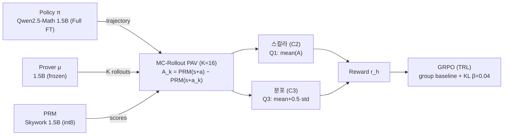

# PAV-RL: Distributional Process Advantages for Diverse Math Reasoning

공개 PRM(Skywork)의 **step 점수 차분**으로 **분포형 process reward**를 구성하고, **GRPO**로 수학 추론 정책을 추가 학습하는 파이프라인. PRM을 따로 학습하지 않고, μ로 굴린 **K개 rollout advantage 표본의 통계**로 분포를 *구성*한다 — 정답률을 유지하면서 **풀이 다양성**을 보존하는 것이 목표.

> 강화학습 텀프로젝트 · 김청해 · 이경민 · 이송헌 (DMSLAB, Konkuk Univ.)
> 본문/실행 가이드는 **[`PAV/`](PAV/)** 하위에 있습니다 → [PAV/README.md](PAV/README.md)

## 핵심 가설
- **H1** — 스칼라 RLVR 대비 **분포형 보상**은 pass@1을 유지하면서 **pass@k·풀이 다양성**에서 우수하다.
- **H2** — 기초 수학(**GSM8K**) 학습만으로 **올림피아드급(AIME)** 난이도로 일반화된다.

## 핵심 아이디어
- **보상의 대상을 진전(progress)으로** — 가치 Q가 아니라 advantage $A^\mu = Q^\mu - V^\mu$ (Rewarding Progress, PAV).
- **분포는 학습이 아니라 구성** — μ로 K개 대안 step을 굴려 $A_k = \mathrm{PRM}(s{+}a) - \mathrm{PRM}(s{+}a_k)$ 표본을 만들고, reducer로 접는다.
- **reducer만 바꿔 비교** — **스칼라 C2**(Q1: mean) vs **분포 C3**(Q3: mean − λ·std, λ=−0.5 → mean + 0.5·std, risk-seeking).



## 학습 구성

| 항목 | 값 |
|---|---|
| 정책 π / Prover μ | Qwen2.5-Math-1.5B-Instruct (π=**Full FT**, μ=frozen) |
| PRM | Skywork-o1-Open-PRM-Qwen-2.5-1.5B (**int8**) |
| PAV | MC-rollout, **K=16**, α=3.0 |
| GRPO | group 8 · lr **2.0e-6**(cosine, warmup 50) · KL β 0.04 · clip 0.2 · grad_accum 8 · **adamw_bnb_8bit** · max_completion 256 |
| 데이터 | 학습 **GSM8K** / 평가 **AIME 2023–2025**(89문항) |
| 프롬프트 | **few-shot 1-shot + "Step k:" 강제 포맷** (PRM step 정합) |

## 분산 학습 환경
한 GPU에 π(Full FT)+μ+PRM을 동시에 못 올려, frozen μ·PRM을 추론 서버로 분리하고 **로드밸런서**로 묶었다.

- **학습 PC** — 보유 **RTX 3090 (24GB)**: GRPOTrainer + π Full FT + vLLM colocate(0.30)
- **추론 서버 풀 ×N** — 클라우드 **T4 (16GB)** 인스턴스: μ vLLM(:8001) + PRM FastAPI(:8002)
- **로드밸런서** — HTTP/JSON routing · round-robin · health-check (weight broadcast 0, step당 RPC ~6MB)

## 결과 요약 (AIME 89문항, checkpoint-500)

| 지표 | 분포 C3 +few-shot | 분포 C3 | 스칼라 C2 | Baseline |
|---|---|---|---|---|
| Pass@1 | 0.083 | 0.084 | 0.088 | 0.084 |
| **Pass@256** | **0.405** | 0.348 | 0.348 | 0.337 |
| 평균 distinct 답 | **34.9** | 30.4 | 30.7 | 31.0 |
| 정규화 엔트로피 | **0.471** | 0.435 | 0.433 | 0.434 |

- **분포형(few-shot Q3)이 pass@256·다양성(distinct·엔트로피)에서 우위** → H1 지지.
- 학습 동역학: **분포(C3)는 reward_std를 끝까지 유지**(탐색 다양성 보존), **스칼라(C2)는 후반 붕괴**.
- 3-run 학습변화량 비교 → [PAV/outputs/comparison/training_comparison.md](PAV/outputs/comparison/training_comparison.md)

> 셋 다 5000 step 계획 중 **~500 step(epoch≈0.54)** 초기 스냅샷 — 절대 성능보다 **조건 간 차이**에 주목.

## 저장소 구조 / 문서
```
DRL-TERM_PROJECT/
└── PAV/                     # 본체 (코드·설정·문서)
    ├── src/                 # prm · pav · rollout · train · swap · eval
    ├── configs/             # rl_q3.yaml(C3) · rl_c2_scalar.yaml(C2) · policy · prm
    ├── scripts/             # 03_grpo_train.py · plot_compare3.py · serve_prm_http.py ...
    ├── outputs/comparison/  # 3-run 비교 그래프·리포트
    └── docs/                # 아래 문서
```
- [PAV/docs/TRAINING_CONFIG.md](PAV/docs/TRAINING_CONFIG.md) — 현재 학습 설정 스냅샷
- [PAV/docs/QUICKSTART.md](PAV/docs/QUICKSTART.md) — 분산(3090 + cloud T4) / 단일 PC 실행 가이드
- [PAV/docs/TRAINING_FLOW.md](PAV/docs/TRAINING_FLOW.md) — 시스템 구조 · 데이터 흐름 다이어그램
- [PAV/docs/IMPLEMENTATION_REPORT.md](PAV/docs/IMPLEMENTATION_REPORT.md) — 구현 결정 · 모듈 책임 · 검증 게이트

## 참고
Rewarding Progress (PAV, ICLR'25) · QRM · Skywork-o1-PRM · DeepSeekMath(GRPO). 상세는 발표자료 Reference 참고.
