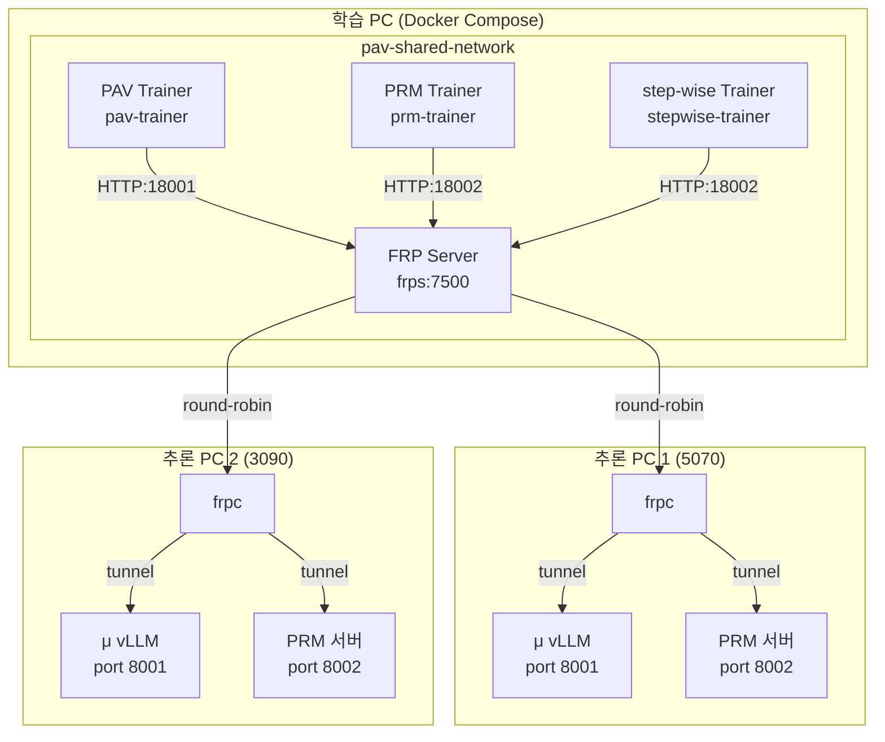

# 통합 FRP 서버 사용 가이드

PAV, PRM, step-wise-PRM 이 **하나의 FRP 서버**를 공유하여 사용하는 방법을 설명합니다.

## 아키텍처



## 네트워크 구성

### 1. PAV (FRP 서버 + Trainer)

```yaml
# PAV/docker-compose.yml
services:
  frps:
    image: fatedier/frps:v0.61.0
    networks:
      - pav-shared-network
  
  trainer:
    # ... PAV trainer 설정
    networks:
      - pav-shared-network

networks:
  pav-shared-network:
    name: pav-shared-network
    driver: bridge
```

### 2. PRM (Trainer만)

```yaml
# PRM/docker-compose.yml
services:
  prm-trainer:
    # ... PRM trainer 설정
    networks:
      - pav-shared-network

networks:
  pav-shared-network:
    external: true
    name: pav-shared-network
```

### 3. step-wise-PRM (Trainer만)

```yaml
# step-wise-PRM/docker-compose.yml
services:
  stepwise-prm-trainer:
    # ... step-wise trainer 설정
    networks:
      - pav-shared-network

networks:
  pav-shared-network:
    external: true
    name: pav-shared-network
```

## 실행 순서

### 1단계: FRP 서버 시작 (PAV)

```bash
cd PAV
docker compose up -d frps
```

- `frps`가 `pav-shared-network`를 생성합니다.
- dashboard: http://localhost:7500

### 2단계: 추론 PC 등록 (Inference PC)

각 추론 PC에서 **PAV의 `docker-compose.inference.yml`을 재사용**합니다:

```bash
cd PAV  # PAV 디렉토리의 inference 설정 사용
docker compose -f docker-compose.inference.yml up -d
```

이 파일은 이미 다음을 포함합니다:
- **μ vLLM 서버** (port 8001) → `mu_cluster`
- **PRM FastAPI 서버** (port 8002) → `prm_cluster`
- **FRP 클라이언트** (frpc)

`frpc.toml` 설정 (`PAV/frp/frpc.toml`):
```toml
# μ vLLM 서버
[[proxies]]
name = "mu-{{ .Envs.NODE_NAME }}"
type = "tcp"
localIP = "mu-server"
localPort = 8001
remotePort = 18001
loadBalancer.group = "mu_cluster"

# PRM 서버
[[proxies]]
name = "prm-{{ .Envs.NODE_NAME }}"
type = "tcp"
localIP = "prm-server"
localPort = 8002
remotePort = 18002
loadBalancer.group = "prm_cluster"
```

> **참고**: PRM과 step-wise-PRM은 추론 PC에서 **PRM 서버만** 필요할 수 있습니다.
> μ 서버는 PAV 학습에만 사용됩니다.
> 
> PRM 서버만 실행하려면:
> ```bash
> cd PAV
> docker compose -f docker-compose.prm-only.yml up -d
> ```
> 
> 이 파일은 `mu-server`를 제외하고 PRM 서버 + frpc만 실행합니다.

### 3단계: 학습 시작

**PAV 학습:**
```bash
cd PAV
docker compose up -d trainer
```

**PRM 학습:**
```bash
cd PRM
docker compose up -d prm-trainer
```

**step-wise-PRM 학습:**
```bash
cd step-wise-PRM
docker compose up -d stepwise-prm-trainer
```

> **동시 실행 가능**: 세 가지 학습을 동시에 실행할 수 있습니다.
> FRP LB가 각 요청을 round-robin으로 분배합니다.

## 환경변수 설정

### PAV `.env`
```bash
FRPS_TOKEN=your-random-32-char-token
FRPS_DASHBOARD_PW=your-dashboard-password
HF_TOKEN=your-huggingface-token
```

### PRM / step-wise-PRM `.env`
```bash
# FRP 서버는 PAV에서 실행 중이므로 별도 설정 불필요
# 자동으로 pav-shared-network를 통해 frps에 연결
HF_TOKEN=your-huggingface-token
```

## 포트 사용 현황

| 포트 | 용도 | 서비스 |
|------|------|--------|
| 7000 | FRP control | frps |
| 7500 | FRP dashboard | frps |
| 18001 | μ cluster | frps → μ vLLM |
| 18002 | PRM cluster | frps → PRM 서버 |

## 문제 해결

### 네트워크 연결 오류

```bash
# pav-shared-network가 존재하는지 확인
docker network ls | grep pav-shared-network

# 없으면 PAV의 frps를 먼저 실행
cd PAV
docker compose up -d frps
```

### FRP dashboard에서 replica 확인

http://localhost:7500 에 접속하여:
- `mu_cluster` 그룹의 online 프록시 수 확인
- `prm_cluster` 그룹의 online 프록시 수 확인

### 로그 확인

```bash
# PAV trainer 로그
docker logs -f pav-trainer

# PRM trainer 로그
docker logs -f prm-trainer

# step-wise trainer 로그
docker logs -f stepwise-prm-trainer

# FRP 서버 로그
docker logs -f pav-frps
```

## 성능 최적화

### PRM 서버 수 증가

추론 PC를 추가할 때마다:
1. 새 PC에 Docker + NVIDIA runtime 설치
2. `frpc.toml`의 `NODE_NAME`을 고유하게 설정
3. `docker-compose.inference.yml` 실행

자동으로 FRP LB pool에 등록됩니다.

### 동시 학습 시 주의사항

- **GPU 메모리**: 각 trainer는 별도 GPU를 사용해야 함
- **PRM 서버 부하**: 동시 학습 시 PRM 서버가 병목될 수 있음
  - 해결: PRM 서버를 더 많은 추론 PC에 분산
- **네트워크 대역**: FRP tunnel이 네트워크를 많이 사용함
  - 학습 PC와 추론 PC는 같은 LAN에 있는 것이 좋음

## 요약

| 구성요소 | 위치 | 네트워크 |
|---------|------|----------|
| FRP 서버 | PAV/docker-compose.yml | `pav-shared-network` (생성) |
| PAV Trainer | PAV/docker-compose.yml | `pav-shared-network` (연결) |
| PRM Trainer | PRM/docker-compose.yml | `pav-shared-network` (외부) |
| step-wise Trainer | step-wise-PRM/docker-compose.yml | `pav-shared-network` (외부) |
| μ/PRM 서버 | 추론 PC | FRP tunnel |

> **핵심**: PAV가 FRP 서버 + 네트워크를 생성하고, PRM과 step-wise-PRM은 외부 네트워크로 연결합니다.
